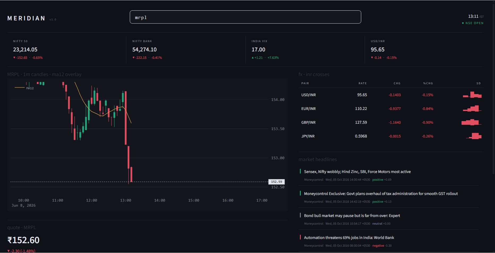
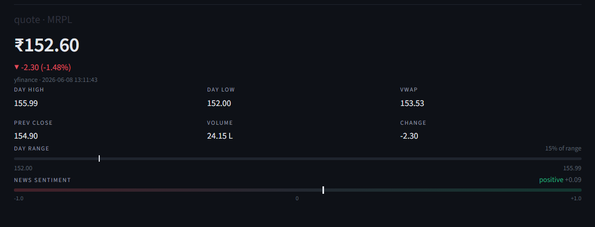
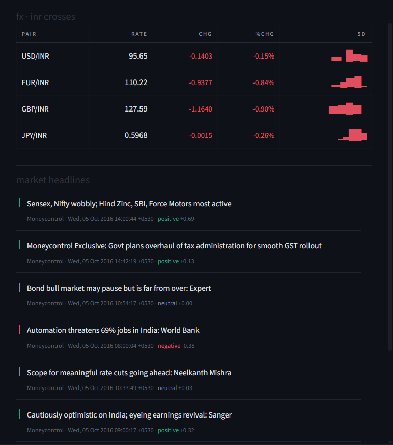

# Meridian

A modular, multi-window Indian Financial Dashboard — real-time NSE equity quotes, INR forex crosses, macro indices, and sentiment-scored news in a dark Bloomberg-style terminal layout.

## Features

- **Live candlestick chart** — full TradingView Advanced Chart widget with intraday data, indicators, drawing tools
- **NSE equity quotes** — current price, day high/low, VWAP, volume, day-range bar
- **INR forex desk** — USD, EUR, GBP, JPY vs INR with inline unicode sparklines
- **Macro tape** — Nifty 50, Nifty Bank, India VIX, USD/INR at a glance
- **News sentiment** — VADER-scored headlines from Moneycontrol & Economic Times
- **Market status badge** — live IST clock + NSE Open/Closed indicator
- **Dark terminal UI** — clean monospaced layout, no neon, no bloat

## Screenshots

<!--
   Drop your screenshots in the screenshots/ folder and reference them here.
   Replace the placeholder paths below with the actual filenames.
-->

Full dashboard view:



Equity quote panel with day-range bar and sentiment bar:



Forex desk with sparklines and news feed:



## Project Structure

```
meridian/
├── app.py               # Streamlit entry point — layout + wiring
├── data_provider.py      # All external I/O — yfinance, nsepython, RSS
├── analytics.py          # Math & NLP — VADER sentiment, MA indicators
├── components.py         # UI panels — charts, tables, news feed, macro strip
├── screenshots/          # Screenshots for the README (you add these)
├── _backup_v1/           # Archive of the previous Plotly-based UI
├── README.md
└── LICENSE
```

Architecture rules:
- `components.py` contains **zero data fetching** — strict renderers only
- `analytics.py` contains **zero UI code** — pure computation only
- `app.py` only orchestrates — no math, no network calls

## Tech Stack

| Layer | Library |
|-------|---------|
| Dashboard | [Streamlit](https://streamlit.io) |
| Live chart | [TradingView Advanced Chart Widget](https://www.tradingview.com/widget/) |
| NSE data | [nsepython](https://pypi.org/project/nsepython/) |
| Historical & macro | [yfinance](https://pypi.org/project/yfinance/) |
| Static charts | [Plotly](https://plotly.com/python/) |
| Sentiment | [NLTK VADER](https://www.nltk.org/) |
| News RSS | [feedparser](https://feedparser.readthedocs.io/) |

## Setup

```bash
# 1. Clone or cd into the project
cd meridian

# 2. Install dependencies
pip install streamlit nsepython yfinance pandas numpy plotly nltk feedparser

# 3. Launch
streamlit run app.py
```

The first run will auto-download the VADER lexicon (`nltk.download("vader_lexicon")`).

## Usage

1. Type any NSE equity symbol in the search bar: `RELIANCE`, `TCS`, `INFY`, `HDFCBANK`, `NIFTY`, etc.
2. The chart, quote panel, and news feed update on search change.
3. INR forex crosses and macro indices refresh every 60 seconds.
4. News headlines refresh every 3 minutes.
5. Re-run the script or hit **R** in the browser to reload.

## Reverting to the Plotly-based UI

The previous iteration (Plotly candlestick + VADER half-circle gauge) is archived in `_backup_v1/`.

```bash
Copy-Item _backup_v1\*.py .
```

## License

MIT — see [LICENSE](LICENSE)
